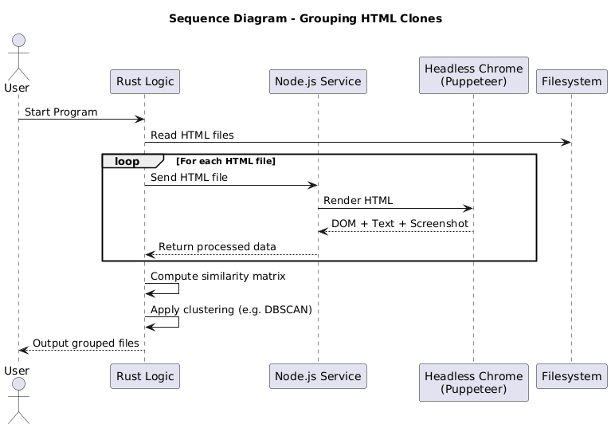

# HTML Clone Detector


## Short Description
A high-performance, scalable tool that detects and groups visually similar (“clone”) HTML documents based on how they render in a web browser.

## Long Description
The main purpose of this project is to identify and group HTML files that appear visually identical in a headless browser, even if their underlying code differs slightly. The solution leverages:
- **Rust** for high-speed logic and clustering mechanisms (DBSCAN or similar).
- **Node.js + Puppeteer** for rendering HTML in a headless browser, extracting visible text, and capturing screenshots.
- A custom similarity analysis module that calculates and groups “clone sets” of HTML documents.

In real-world scenarios, multiple web pages may share structural or textual content but differ in small code details. This project focuses on efficiency, parallelization, and consistent data extraction to form coherent clusters of similar pages.

---

## Project Structure
```
HTML-CLONE-DETECTOR/
├── dataset/
├── diagrams/
├── node-renderer/
│   ├── node_modules/
│   ├── src/
│   │   ├── constants.js
│   │   ├── main.js
│   │   ├── pool.js
│   │   └── scanner.js
│   ├── package.json
│   └── package-lock.json
├── output/
├── rust-core/
│   ├── src/
│   │   ├── clustering.rs
│   │   ├── constants.rs
│   │   ├── image_processor.rs
│   │   ├── loader.rs
│   │   ├── main.rs
│   │   └── vectorizer.rs
│   ├── Cargo.toml
│   └── Cargo.lock
├── .gitignore
├── dev_progress_log.txt
├── README.md
└── to_do.txt
```

---

## Technologies Used
This project leverages a dual-language architecture to combine performance and flexibility:
- **Rust**: Used for CPU-intensive clustering, parallelism (with Rayon), and image/text vectorization. Its memory safety and speed make it ideal for real-time grouping of thousands of pages.
- **Node.js + Puppeteer**: Handles the dynamic rendering of HTML pages in a headless browser (Chrome). Captures screenshots and extracts visible text exactly as seen by the user.
- **PlantUML / Diagrams**: Used to document the sequence and architecture of the system.
- **npm**: For managing JavaScript dependencies in the rendering layer.

---

## Tests

### Node Renderer Tests

**Test 1 – 193 files**
```bash
node main.js
✅ Processing complete in 15.58s
```

**Test 2 – 1102 files**
```bash
node main.js
✅ Processing complete in 74.68s
```

**Test 3 – 2073 files**
```bash
node main.js
✅ Processing complete in 129.09s
```

**🧩 Conclusion:** The Node.js renderer scaled linearly with the number of files and completed all runs without errors. Even with over 2,000 HTML pages, rendering remained stable and fast.

---

### Rust Core Tests

**Test 1 – 193 files**
```bash
cargo run --release
✅ Processing completed in 346.77ms
```

**Test 2 – 1102 files**
```bash
cargo run --release
✅ Processing completed in 1.21s
```

**Test 3 – 2073 files**
```bash
cargo run --release
✅ Processing completed in 2.16s
```

**🧠 Conclusion:** The Rust clustering engine handled thousands of documents in milliseconds, confirming its performance and suitability for batch processing. It consistently formed stable clusters across tiers and test runs.

---

## Usage

1. **Clone the repository**:
```bash
git clone <repo-url>
cd HTML-CLONE-DETECTOR
```
2. **Install Node.js dependencies**:
```bash
cd node-renderer
npm install
```
3. **Run the HTML rendering script**:
```bash
cd src
node main.js
```
4. **Compile and run the Rust component**:
```bash
cd ../../rust-core
cd src
cargo run --release
```

---

## Sequence Diagram
The system consists of two main components: a Node.js renderer and a Rust-based clustering engine.



---

## Development Time
The analysis and architecture design took approximately 1 hour and 30 minutes. The Node-based part required around 6 hours and 31 minutes, including optimization and more detailed output, with a final runtime of ~32 seconds. The Rust part took about 2 hours and 40 minutes, including optimization, with processing completed in roughly 1.2 seconds after the HTML rendering step. Additionally, testing with various scenarios added another 5 hours to the overall effort.

**Total**: approximately 15 hours and 41 minutes.

---

## Author
- **Name**: Savciuc Constantin  
- **Email**: savciuccu@gmail.com  
- **Location**: Bucharest, Romania